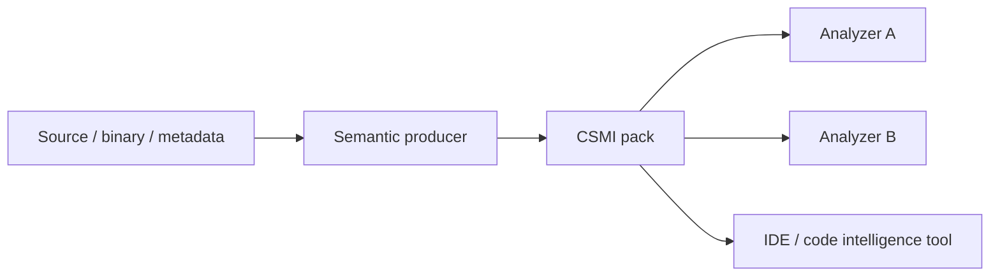
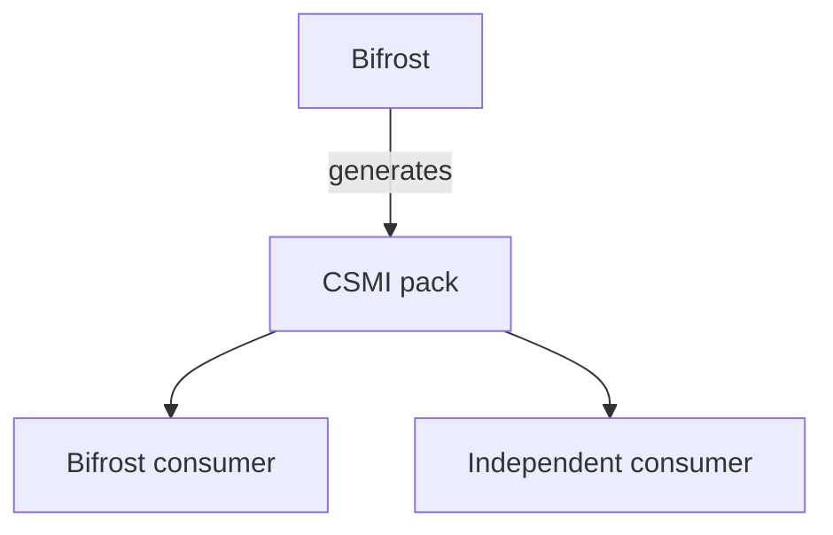

# Code Semantic Model Interchange

**CSMI** is an experimental, language-neutral interchange specification for portable semantic models of code.

Read the navigable [CSMI documentation](https://csmi.brokk.ai/) or go directly
to the [v0.1 specification](https://csmi.brokk.ai/specification/v0-1/) and
[JSON Schema](https://csmi.brokk.ai/schema/0.1/schema.json).

Standard profiles now cover several language ecosystems plus analyzer-neutral
[identity-separating value transfers](profiles/value-transfer/0.1/profile.md).
The [C and C++ profile](profiles/cpp/0.1/profile.md) supplies exact artifact,
resolver, alias, and declaration identity for the initial `std::basic_string`
case. Their [value-transfer](conformance/value-transfer.md) and
[C/C++](conformance/cpp-profile.md) suites include positive, near-miss,
indeterminate, and fail-closed cases grounded in the native Bifrost contract.

The goal is simple: one tool should be able to describe the semantics of a library, framework, dependency, generated API, or otherwise unavailable implementation, and an unrelated analysis tool should be able to consume that knowledge without sharing the producer's internal representation.

> **Status:** early proposal. CSMI is not yet a stable standard. The initial work is intended to establish a small interoperable core, implement it in [Bifrost](https://github.com/BrokkAi/bifrost), and validate it with at least one independent consumer.

## Why this exists

Static analysis works best when an analyzer can inspect every relevant implementation. Real software rarely provides that luxury.

Applications routinely depend on code that is:

- distributed as binaries rather than source;
- expensive or impractical to analyze repeatedly;
- implemented in another language;
- generated dynamically;
- supplied by frameworks, runtimes, or native libraries;
- hidden behind dependency boundaries; or
- better modeled by domain knowledge than by source analysis alone.

Most language ecosystems have a way to describe the *shape* of external code. Python has type stubs, TypeScript has declaration files, JVM and .NET tooling have metadata, and code-intelligence systems index symbols, definitions, references, and signatures.

Those mechanisms generally do not provide enough portable behavioral information for deeper program analysis.

An analyzer may need to know facts such as:

```text
parameter[0] -> return
parameter[1] -> receiver.field[x]
receiver.field[y] -> exceptional_return
```

It may also need to know that a call allocates, mutates its receiver, invokes a callback, escapes an argument, sanitizes a value, or has no additional effects beyond those explicitly modeled.

Static-analysis systems therefore maintain library models, procedure summaries, framework models, and other semantic knowledge. These are useful, but they are usually tied to a specific analyzer.

CSMI proposes a common interchange boundary for that semantic knowledge.

## The model

A producer derives semantic information from source, binaries, metadata, expert-authored models, or some combination of those inputs:



The producer and consumers do not need to share a compiler, intermediate representation, query language, or analysis engine.

A semantic model becomes a portable artifact.

## Illustrative example

Suppose a dependency exposes:

```java
class Strings {
    static String normalize(String input) {
        // implementation unavailable to the application analyzer
    }
}
```

A CSMI procedure summary could state that the first parameter flows to the normal return value:

```yaml
# Illustrative syntax; not yet normative.
procedure_summaries:
  - symbol: Strings.normalize
    transfers:
      - from:
          parameter: 0
        to:
          return: normal

    completeness:
      transfers: complete
```

An analyzer examining:

```java
String input = request.getParameter("name");
String normalized = Strings.normalize(input);
save(normalized);
```

can preserve the flow through `Strings.normalize` without inspecting its implementation.

The important property is not that Bifrost can read the model. The important property is that *another analysis engine can assign the same meaning to it*.

## Proposed scope

The first version of CSMI should be deliberately small. The initial semantic core is expected to cover the following areas.

### Artifact identity

A model must identify the software artifact to which it applies, including enough information to determine compatibility safely.

CSMI should reuse existing standards where they already solve this problem. In particular, [Package URL (PURL / ECMA-427)](https://github.com/package-url/purl-spec) is a strong candidate for cross-ecosystem package identity.

Artifact digests and version constraints may additionally be required where package coordinates alone are insufficient.

### Symbol identity

Models must refer unambiguously to externally visible program entities such as types, methods, functions, fields, and parameters.

CSMI should reuse or adapt proven language-neutral symbol-addressing concepts rather than inventing another incompatible symbol grammar without need.

### Declarations

CSMI may carry the declaration facts required to interpret semantic summaries, including:

- types;
- members;
- callables and signatures;
- inheritance and implementation relationships; and
- selected symbol relationships.

CSMI is not intended to replace a language's complete type system.

### Procedure summaries

The principal behavioral abstraction is a procedure summary.

A procedure can expose semantic input locations such as:

```text
receiver
parameter[n]
heap location
captured value
```

and output locations such as:

```text
receiver
normal return
exceptional return
heap location
```

A summary can then express relationships between those locations without prescribing how a consumer implements its dataflow engine.

### Effects

Some behavior is not naturally represented as a value transfer. Procedure models may therefore describe effects such as:

```text
allocation
mutation
escape
call
```

CSMI 0.1 deliberately does not make those words generic core facts. Allocation,
mutation, escape, and invocation each need a versioned profile that defines its
targets, modality, observation boundary, merging, and completeness. Mutation is
the strongest candidate for a first standard effect profile because it can
reuse core boundary locations without standardizing an analyzer heap model.

More specialized domains should likewise be expressed as versioned profiles or
extensions rather than forcing every CSMI consumer to implement every possible
analysis vocabulary.

The [`csmi.value-transfer` 0.1.0 profile](profiles/value-transfer/0.1/profile.md)
adds copy, aggregate-copy, move, conversion, boxing, and unboxing semantics to
selected core transfers without changing the CSMI 0.1 core. It keeps value
dependence separate from storage identity, preserves source invalidation and
value-preservation uncertainty, and requires exact implicit-operation identity.
The independent [C and C++ profile family](profiles/cpp/0.1/profile.md) uses
`csmi.c-cpp-resolution` for the shared structured resolution boundary and
`csmi.cpp` for the canonical `std::basic_string` fixtures.

A normative language profile defines deterministic Python import and
declaration identity, distribution-to-import mappings, runtime/stub
correspondence, and compatibility boundaries. See the
[`csmi.python` 0.1 profile](profiles/python/0.1/profile.md) and its
[conformance cases](conformance/python-profile.md).

### Completeness

Missing information is not the same thing as absence of behavior.

A portable semantic model must be able to distinguish at least these cases:

```text
These are all transfers.
These are the transfers currently known by the producer.
No semantic model is available.
```

Completeness is therefore part of the semantic contract, not merely metadata. Without it, consumers can accidentally turn partial models into false guarantees and unsound analysis results.

### Provenance

Consumers need enough provenance to decide whether a semantic model should be trusted and whether it applies to the artifact being analyzed.

Relevant metadata may include:

- producer identity and version;
- generation method;
- target package and version constraints;
- source artifact digest;
- creation metadata;
- confidence or certainty; and
- model completeness.

CSMI distinguishes the semantic producer that established a fact from the pack
assembler that selected and packaged existing resources. Facts and completeness
claims retain producer provenance; the pack manifest records assembly,
licensing, and byte integrity without becoming a second source of semantic
truth.

## Non-goals

CSMI is **not** intended to standardize an analyzer's internal intermediate representation.

It is not intended to encode arbitrary ASTs, control-flow graphs, SSA graphs, or complete whole-program representations.

It is not intended to standardize analysis findings or diagnostics.

It is not intended to define application-specific security policy such as which values should be considered sensitive.

It is not intended to require every consumer to support every semantic domain.

The core should remain small enough that independent producers and consumers can realistically implement it.

## Related work

CSMI builds on substantial prior work. The proposal is not that procedure summaries or library models are new; the gap is the lack of a broadly adopted, analyzer-neutral interchange format for distributing them across tools.

### SARIF

[SARIF](https://www.oasis-open.org/standard/sarif-v2-1-0/) standardizes the **output** of static-analysis tools: findings, locations, rules, diagnostics, and related result metadata.

CSMI addresses the other side of analysis:

```text
                 semantic knowledge
                        |
                        v
source code ------> analyzer ------> findings
                        |                |
                       CSMI            SARIF
```

SARIF communicates what an analyzer found. CSMI is intended to communicate semantic knowledge that an analyzer may use while performing its analysis.

The two formats are complementary.

### SCIP, LSIF, and code-intelligence indexes

[SCIP](https://github.com/scip-code/scip) is a language-agnostic protocol for indexing source code and supporting operations such as definitions, references, and implementations. LSIF and systems such as Kythe address closely related code-intelligence problems.

That work overlaps strongly with the symbol and declaration-identification problem CSMI must solve. CSMI should reuse proven concepts from this ecosystem where practical.

Its additional concern is analyzer-independent *behavioral* semantics: value transfer, effects, exceptional behavior, escapes, completeness, and related procedure properties.

### Type stubs and declaration files

Python `.pyi` files, TypeScript `.d.ts` files, interface metadata, and similar mechanisms are extremely useful representations of API surfaces.

Their primary concern is declarations and type information rather than portable behavioral summaries. CSMI is intended to complement these mechanisms, not replace them.

### CodeQL model packs

[CodeQL model packs](https://docs.github.com/en/code-security/tutorials/customize-code-scanning/create-and-work-with-codeql-packs) are particularly close prior art. They allow library and framework behavior to be modeled separately from source and distributed as packs. Their data extensions can add semantic knowledge for dependencies to CodeQL analyses.

This demonstrates that distributable dependency semantics solve a real problem.

CSMI differs in its intended abstraction boundary: the semantic representation should not depend on CodeQL predicates, a CodeQL query pack, or any other single analysis engine. A model produced for one consumer should be meaningfully consumable by another.

A future CodeQL adapter is therefore an important interoperability test for CSMI.

### Code Property Graphs

Code Property Graph ecosystems provide language-neutral representations of program structure and semantics and are useful interchange representations for analyzed programs.

CSMI has a narrower target. Rather than representing an entire program, it aims to represent portable semantic knowledge about externally referenced program entities, particularly dependencies and APIs.

### Analyzer-specific summaries

Static-analysis frameworks have long supported hand-authored or synthesized summaries for unavailable library code. This is important prior art and reinforces the usefulness of the abstraction.

CSMI's goal is not to replace those internal models. It is to identify the subset of their meaning that can be exchanged between independent implementations.

## Design principles

### Analyzer neutrality

A core CSMI concept should not depend on the internal representation of one analyzer.

If a semantic concept cannot be implemented meaningfully by a second independent consumer, it is a strong candidate for an extension rather than the core specification.

### Language neutrality

The model should describe concepts such as parameters, returns, receivers, heap locations, transfers, and effects without requiring Java, Python, Rust, JavaScript, or another specific source language.

Language-specific semantics may be represented through extensions.

### Explicit uncertainty

Unknown, partial, and complete information must remain distinguishable.

Consumers must not be forced to interpret omitted fields as semantic guarantees.

### Extensibility

Analysis domains evolve faster than a core interchange specification should.

CSMI should support standardized profiles and namespaced extensions such as:

```text
csmi.security.taint
csmi.effects.io
csmi.effects.network
csmi.ownership
csmi.concurrency
csmi.typestate
```

These are illustrative future names, not assigned profiles.

and implementation-specific extensions such as:

```text
ai.brokk.bifrost.*
```

Standard profiles reserve the `csmi.` namespace. Vendor extensions use a
publisher-controlled reverse-DNS namespace. Every exact-versioned use must say
whether it is optional or required and identify the semantic units it affects,
so an unsupported consumer can fail closed without discarding unrelated facts.

### Existing standards first

Where another specification already solves an identity or metadata problem well, CSMI should integrate it rather than create a competing representation.

Potential examples include PURL for package identity and SPDX identifiers for licensing metadata.

### Deterministic interchange

Equivalent semantic models should have a deterministic or canonical representation where practical, enabling reproducible generation, content addressing, caching, signing, comparison, and deduplication.

## Packs and transport

A **CSMI pack** is a content-addressed collection of semantic documents and
supporting resources. Semantic documents remain self-describing and own
artifact applicability, vocabulary uses, facts, completeness, and producer
provenance. The root manifest owns resource descriptors, assembly identity,
licensing, and integrity.

A pack logically contains its root manifest, one or more semantic-document
resources, and any described supporting resources such as vocabulary schemas,
license texts, notices, or auxiliary data. CSMI does not prescribe how those
logical resources are laid out by a transport.

Each resource is described by a safe logical path, media type, byte size, and
SHA-256 digest. The pack digest is the SHA-256 of its RFC 8785-canonical root
manifest, which commits transitively to every described resource. Detached
signatures or attestations can name that digest later without changing the
pack's identity.

The semantic data model is separate from its transport and registry mechanism.
A directory, archive, OCI artifact, or future registry may carry the same
logical pack; transport and registry protocols are outside CSMI 0.1.

## Bifrost and CSMI

[Bifrost](https://github.com/BrokkAi/bifrost) is expected to be the first CSMI producer and consumer.

The intended architecture is:

```text
Bifrost internal model -> CSMI pack
CSMI pack -> Bifrost analysis
```

That alone is not sufficient evidence of interoperability. The critical milestone is an independent consumer that does not depend on Bifrost internals:



If two unrelated consumers assign the same relevant meaning to a model, the interchange boundary has been demonstrated independently of Bifrost.

The public [CSMI demo repository](https://github.com/BrokkAi/csmi-demo) is where
we will demonstrate this boundary with controlled producer/consumer cases. It
will show independent analyzers consuming the same CSMI pack and compare results
with and without imported semantics. Demo code and results are interoperability
evidence, not normative specification material.

## Repository structure

The normative schema, fixtures, and validation tooling live beside the prose:

```text
spec/
  0.1/
    specification.md
    schema.json

examples/
  *.json

profiles/
  rust/
    0.1/
      profile.md
      schema.json
      fixtures/
  value-transfer/
    0.1/
      profile.md
      schema.json
      fixtures/
  cpp/
    0.1/
      profile.md
      schema.json
      fixtures/

fixtures/
  valid/
  invalid/
  semantic-invalid/

conformance/
  *.md

scripts/
  lint-json.py
  validate-profiles.py
  validate-rust-profile.py
  validate-value-transfer.py
  validate-cpp-profile.py
  validate-schema.py
```

The normative specification should live in the repository. A documentation website may render the same material for easier navigation, but should not become a separate source of truth.

The [CSMI 0.1 specification](spec/0.1/specification.md) defines the normative
semantic boundary, while [schema.json](spec/0.1/schema.json) defines the first
machine-readable serialization.

Versioned language profiles remain outside the language-neutral core. The
normative [Rust interoperability profile](profiles/rust/0.1/profile.md) defines
Rust source-item identity, Cargo/crate/sysroot applicability, compilation
configuration, implementation and reexport facts, generation evidence, and the
explicit source-to-native mapping boundary. Its payload schema is
[profiles/rust/0.1/schema.json](profiles/rust/0.1/schema.json), and its semantic
cases are [conformance/rust-profile.md](conformance/rust-profile.md).

## Roadmap

### 0.1 — Core model

Define the smallest useful portable model for:

- artifact identity;
- symbol identity;
- declarations;
- procedure inputs and outputs;
- transfer semantics;
- effect-profile mechanics;
- completeness;
- provenance;
- extension mechanics; and
- schema validation.

### First implementation — Bifrost

Implement CSMI export and import in Bifrost.

### Portability proof — independent consumer

Build a deliberately small analysis that consumes a Bifrost-generated CSMI pack without using Bifrost libraries or internal data structures.

The demo should visibly produce a stronger or more complete result with the semantic pack than without it.

### Ecosystem adapters

Explore meaningful mappings to established ecosystems, particularly CodeQL model packs and SCIP-compatible symbol/declaration data. These adapters should help identify which concepts belong in the portable core and which should remain ecosystem-specific.

### SDKs

Language-specific SDKs, validators, CLIs, and generated bindings may be created separately once the specification stabilizes enough to justify them. The specification repository itself should remain implementation-neutral.

## Contribution policy

Design feedback and interoperability use cases are welcome, but **external pull requests are not accepted at this stage**.

During the initial specification phase, changes to the repository will be authored or incorporated by BrokkAi maintainers. This keeps authorship, licensing, and specification stewardship simple while the model is still changing rapidly.

Please see [CONTRIBUTING.md](CONTRIBUTING.md) for the current policy.

## Repository validation

Run the dependency-free strict JSON lint before committing changes to examples,
fixtures, or schemas:

```sh
python3 scripts/lint-json.py
```

It rejects malformed JSON, duplicate object keys, invalid UTF-8, non-finite
numbers, and invalid Unicode surrogate values.

To meta-validate the Draft 2020-12 schema and check all structural fixture
expectations without installing a CSMI SDK:

```sh
python3 -m venv .venv
.venv/bin/python -m pip install -r requirements-validation.txt
.venv/bin/python scripts/validate-schema.py
.venv/bin/python scripts/validate-profiles.py
.venv/bin/python scripts/validate-rust-profile.py
.venv/bin/python scripts/validate-value-transfer.py
.venv/bin/python scripts/validate-cpp-profile.py
```

The canonical schema identity is
`https://csmi.brokk.ai/schema/0.1/schema.json`; validation uses the repository
copy and does not require network retrieval. GitHub runs both validation layers
after pushes to `main`, then publishes that validated repository copy to the
same path on the GitHub Pages site. The Pages custom-domain setting and DNS
record map `csmi.brokk.ai` to that site; they are deployment configuration, not
an alternate source of schema truth.

Versioned standard profiles have their own normative definitions and payload
schemas. The [Java/JVM interoperability profile](profiles/java-jvm/0.1/profile.md)
keeps Java source
identities distinct from JVM binary linkage identities and defines an explicit,
evidence-bearing mapping between them. Run
`python3 scripts/validate-profiles.py` to validate its schemas and conformance
instances. The value-transfer and C/C++ profiles add dedicated validators for
their cross-record and canonical-identity invariants.

## License

The contents of this repository are licensed under the [Apache License 2.0](LICENSE).
